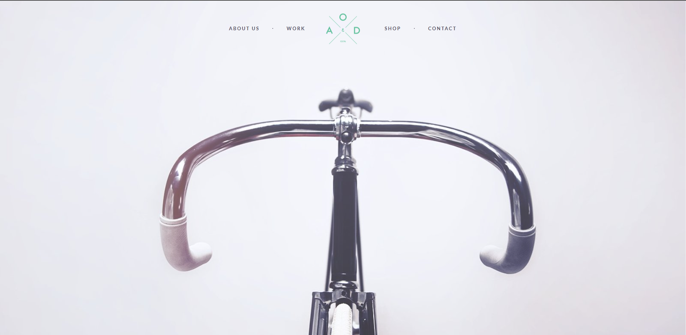

<!-- Project name -->

 

<h1 align="center">:bicyclist: Bicycle Landing Page :biking_woman:</h1>

  

    <a href="https://denyska-h.github.io/Bicycle/">View Demo</a>
    ·
    <a href="https://github.com/Denyska-H/Bicycle/issues">Report Bug</a>
  

<!-- About the project -->

## :bookmark_tabs: About The Project

That's simple landing page with responsive design

<!-- Technologies -->

## :technologist: Tech Stack Used

- HTML
- CSS
- SASS(SCSS)

<!-- CONTACT -->

## :phone: Contacts

Denys Hleba

- [Instagram](https://www.instagram.com/denys.life9)
- [Telegram](https://t.me/realgemba)
- [LinkedIn](https://www.linkedin.com/in/denys-hleba-853326176/)

(<a href="#top">back to top</a>)

